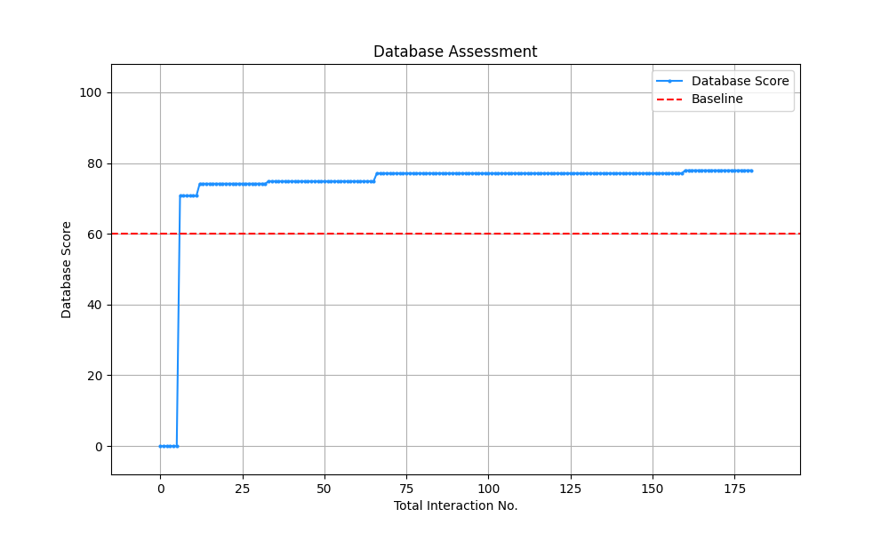

# IdeaSearch-fit-test

This repository provides a demonstration project for the `IdeaSearch-fit` package. To run this project, follow the steps below.

---

## 1\. Configure API Keys

Create an `api_keys.json` file in the root directory of this project. You can do this by copying the `api_keys_template.json` file and populating it with your own valid API keys.

---

## 2\. Create Directories

Create two empty directories in the project root:

- `database`
- `fit_results`

These directories are required because the `IdeaSearch` framework writes its output to `database`, and the `IdeaSearchFitter` class saves its results to `fit_results`.

---

## 3\. Run the Program

Execute the following command from the project's root directory to start the program:

```bash
python -m run
```

## 4\. View results

**database/pic/database_assessment.png**


**fit_results/pareto_report.txt**

```txt
==================================================
           Pareto Frontier Report
==================================================

Complexity: 13
Mean Square Error: 1957.473
Formula: param1 * A * omega * t * exp(-gamma * t)
Timestamp: 251008_180040
Best Parameters:  param1: 2.788536

--------------------------------------------------

Complexity: 14
Mean Square Error: 37.65547
Formula: param1 * A * tanh(omega * t) * exp(-gamma * t)
Timestamp: 251008_180011
Best Parameters:  param1: 4.7294243

--------------------------------------------------

Complexity: 15
Mean Square Error: 37.45705
Formula: param1 * A * (exp(-gamma * t) - exp(-omega * t))
Timestamp: 251008_175249
Best Parameters:  param1: 4.7294243

--------------------------------------------------

Complexity: 21
Mean Square Error: 16.00497
Formula: A * exp(param1 * tanh(param2 * exp((1-2) * gamma * t) * cos(omega * t)))
Timestamp: 251008_180300
Best Parameters:  param1: 4.7294243  param2: 0.1158036

--------------------------------------------------
```
